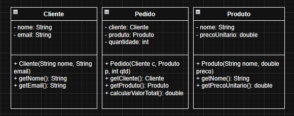

# atividade 1

O principal ponto de discussão do texto está na comparação equívoca entre engenharia de software, e os outros tipos de engenharia. O texto argumenta que a engenharia de software, diferentemente da programação pura, precisa de rigor similar ao das engenharias tradicionais (como a aeronáutica), especialmente porque o software agora controla infraestruturas críticas.

Este rigor é necessário para gerenciar a natureza intangível do software. Enquanto um engenheiro civil vê sua ponte, um engenheiro de software lida com uma arquitetura complexa, muitas vezes invisível, composta por várias linguagens e vários códigos. O texto sugere que falhas (como o custo de operação de uma plataforma ou os desafios de integração de sistemas) não são mais aceitáveis. A "Engenharia de Software" é, portanto, a disciplina que aplica práticas rigorosas para controlar essa complexidade intangível e garantir a confiabilidade.

Principalmente nos dias de hoje, por mais que não seja considerada de tanta importância, talvez por não ser "visível" aos olhos do público, a engenharia de software é importante e crítica, com profissionais que devem ser capaz de manusear e lidar com imprevistos de maneira rápida e eficiente, justamente por ser tão necessária. A engenharia de software é a base de um sistema que pode abranger diversas funcionalidades, e um erro qualquer que seja, pode custar bilhões de dólares.

# atividade 2

Este texto define de forma prática o que é a Engenharia de Software. A definição central é que ela é a "programação integrada ao longo do tempo".

Isso significa que a engenharia de software não é apenas o ato de escrever o código, mas sim a gestão de todo o ciclo de vida desse código. Para fazer isso, os autores propõem que a disciplina seja balanceada sobre três pilares fundamentais:

1.  **Tempo (e Mudança):** Como o código se adapta às mudanças inevitáveis.

2.  **Escala (e Crescimento):** Como a organização e o próprio código se adaptam ao crescimento.

3.  **Trade-offs (e Custos):** As escolhas pragmáticas que precisam ser feitas, balanceando os custos e benefícios das decisões de engenharia.

Em suma, o texto redefine a engenharia de software como uma disciplina estratégica focada na sustentabilidade do código diante das pressões do Tempo, da Escala e dos Trade-offs.
Um profissional dessa área deve ser capaz de lidar com todas essas responsabilidades e sempre pensar na manutenção futura de seu código, organizando tudo pensando nos erros do amanhã.

# atividade 3

O princípio de "Trade-offs e Custos" é, na prática, a **negociação de requisitos não-funcionais**. Raras vezes é possível ter tudo (máxima performance, máxima escalabilidade e máximo baixo custo), então a engenharia exige escolhas de compromisso. 3 grandes exemplos de trade-offs

* **Escalabilidade vs. Simplicidade:** A equipe pode construir um sistema simples (um monólito), que é rápido de desenvolver e fácil de entender no início, mas sacrifica a **escalabilidade** futura. Ou pode começar com uma arquitetura de microsserviços, que é **complexa** e lenta para iniciar, mas que escala horizontalmente com muito mais facilidade.

* **SQL vs. NoSQL:** Uma escolha de banco de dados é um trade-off clássico. **SQL** (como PostgreSQL) oferece consistência forte (ACID) e transações robustas, mas sua escalabilidade horizontal é complexa. **NoSQL** (como MongoDB) oferece imensa escalabilidade horizontal e flexibilidade de esquema, mas geralmente sacrifica a consistência imediata (trabalhando com consistência eventual). A escolha negocia consistência por escalabilidade.

* **Portabilidade (Java) vs. Desempenho (Go):** Ao escolher uma linguagem, negociamos características. **Java** é conhecido por sua extrema **portabilidade** ("Write Once, Run Anywhere") graças à JVM, mas pode ter um "aquecimento" (warm-up) e consumir mais memória. **Go (Golang)** é compilada para um binário nativo, oferecendo um **desempenho** excelente e inicialização quase instantânea, mas o binário é específico para a arquitetura e sistema operacional onde foi compilado, sacrificando a portabilidade fácil da JVM.

# atividade 4

## CLASSES UML

# atividade 5, 6, 7 e 8 na pasta Code

